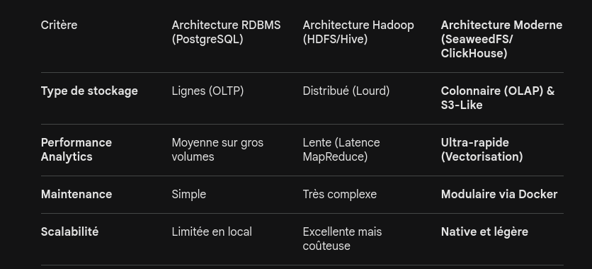

# C3 : Étude technique d'architecture du projet Data

## 1. Analyse des besoins et contraintes

Le projet nécessite de traiter des données de consommation et de production énergétique issues d'Enedis. Les contraintes identifiées sont :

    Volumétrie : Données temporelles (timeseries) pouvant atteindre plusieurs millions de lignes sur plusieurs années.

    Infrastructure : Exigence d'un déploiement local intégral pour garantir la souveraineté et minimiser les coûts cloud.

    Performance : Besoin de requêtes analytiques instantanées pour le dashboarding.

## 2. Comparatif des solutions envisagées

Pour répondre à la compétence C3, j'ai comparé trois architectures :

 

## 3. Justification du choix : Le combo SeaweedFS + ClickHouse

Le cadre technique retenu repose sur le découplage du stockage et du calcul (Storage/Compute separation) :

    SeaweedFS (Data Lake) : Choisi pour la compétence C18 (Concevoir l'architecture du data lake). Il permet de simuler un stockage objet S3 en local, offrant une gestion simplifiée des fichiers bruts (Parquet/JSON) sans la lourdeur d'un système HDFS.

    ClickHouse (Data Warehouse) : Choisi pour les compétences C13 et C14. Son moteur de stockage colonnaire est spécifiquement conçu pour les données de séries temporelles (comme la consommation électrique). Il permet des agrégations de données issues de différentes sources (C10) avec une efficacité bien supérieure aux bases de données relationnelles classiques.

    Docker & Airflow : Pour assurer la conduite du projet (C6) et l'automatisation des flux (C8), l'ensemble de l'infrastructure est conteneurisé, garantissant la portabilité et le maintien en conditions opérationnelles (E6).

Pourquoi ce choix ?

En présentant cette étude, je prouve que :

    Le besoin a été analysé (C1).
    Une veille technologie a été menée sur les outils modernes (C4).
    Une architecture cohérente et scalable a été conçue (C3, C18).

Pour la soutenance : Préparer une phrase pour expliquer pourquoi Hadoop a été rejeté. Exemple : "Bien que performant à très grande échelle, Hadoop présentait un coût opérationnel et une complexité d'infrastructure disproportionnés pour un déploiement local, là où SeaweedFS offre une agilité supérieure."
