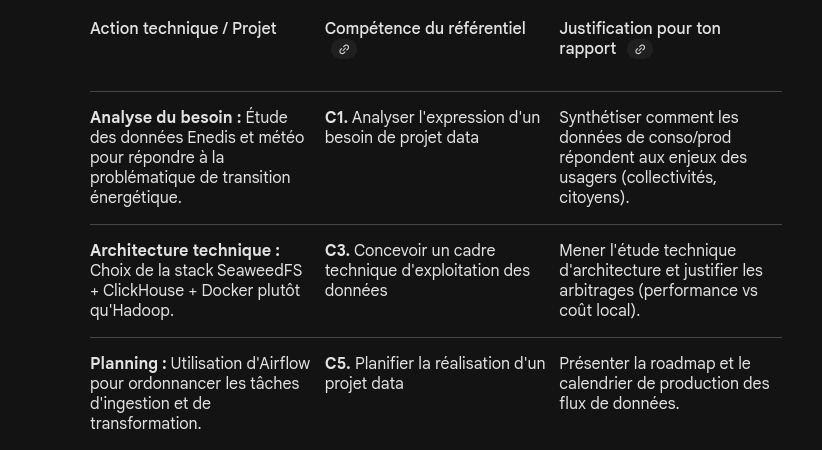
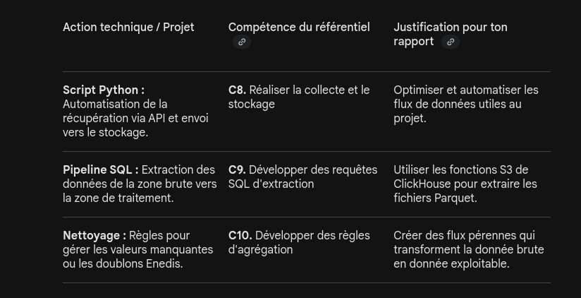
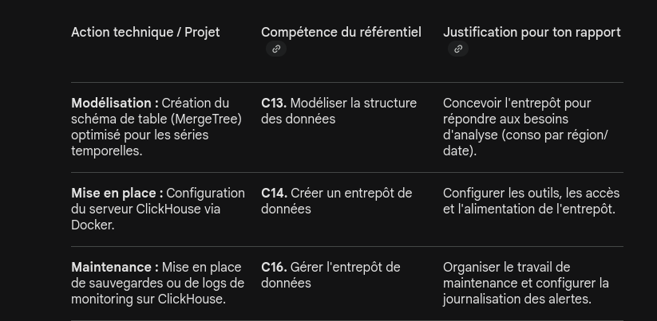
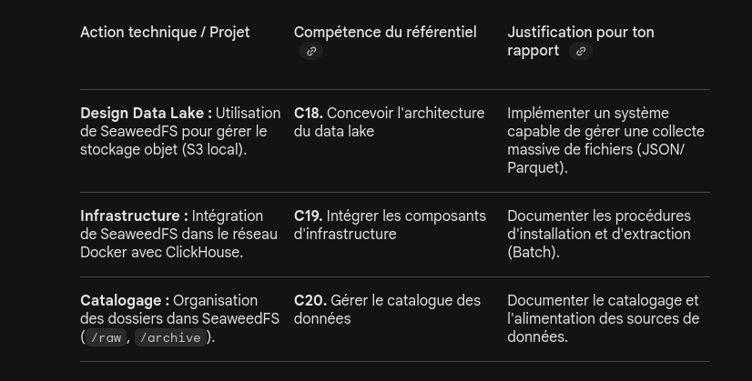

# Parallèles entre le tableau de compétences et le projet

Voici la mise en parallèle entre les actions projet et le référentiel de certification :

## Bloc 1 : Piloter la conduite d’un projet data

Ce bloc concerne la phase d'amont et la gestion. On peut le valider en documentant la phase de réflexion.

  

## Bloc 2 : Collecte, stockage et mise à disposition

C'est ici que le script Python et le Docker entrent en jeu.

  

## Bloc 3 : Entrepôt de données (Data Warehouse)

Ici, on valorise l'utilisation de ClickHouse comme moteur analytique.

  

## Bloc 4 : Collecte massive et Data Lake

C'est le rôle spécifique de SeaweedFS dans l'architecture.

  

## Pour l'oral: 

Le bloc 2 demande une démonstration lors de la présentation orale. Bien préparer l'interface DB-Gate ou le dashboard Streamlit pour montrer les données circulant de SeaweedFS vers ClickHouse en direct.

